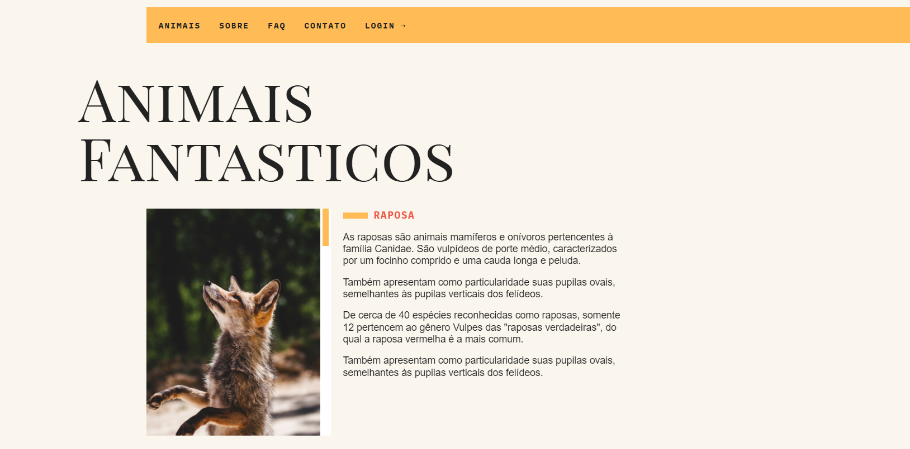

# Animais Fantasticos

> Status: Em Construção ⚠️

## Projeto do Curso de Javascript da Origamid

O objetivo do projeto é que durante do curso seja colocado em pratica todo
conteúdo que for aprendido, é um site bem simples mas com bastante Javascript.
Tecnologias como: Array, Loops, Constructor, Fetch API, Async/Await e outros.

## Tecnologias Usadas

| HTML | CSS | JAVASCRIPT |
| ---- | --- | ---------- |

## Link

[Animais Fantasticos](https://consulta-cep-nu.vercel.app/)
